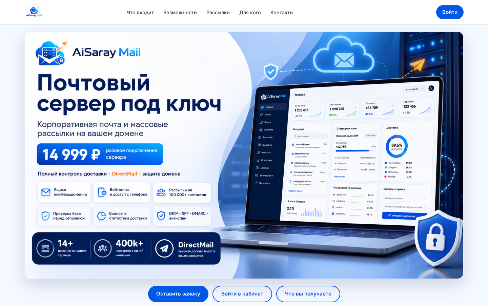
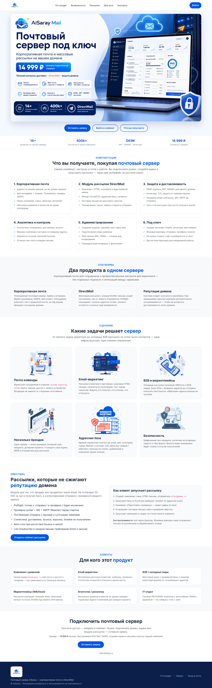

# AiSaray Mail (Email_server) — почтовый сервер + DirectMail

> **Чтобы приобрести данный софт обращайтесь по адресу itshumakher@ g m a il.com**

**AiSaray Mail** — почтовый сервер под ключ с встроенным модулем массовых рассылок **DirectMail**.  
Корпоративная почта на вашем домене и профессиональные email-кампании — в одном контуре, без отдельных подписок «почта отдельно / рассылки отдельно».

Сайт и кабинет: **https://mail.aisaray.ru/**

> Документ для людей и индексации: назначение, роли, модули, сценарии, скриншоты.  
> Исходники, секреты, DNS-каноны с приватными деталями и инфраструктурные рецепты **не публикуются**.

## Официальная ссылка

- https://mail.aisaray.ru/

## Скриншоты

### Лендинг продукта

### Полная страница

### Вход в кабинет

## Кратко о продукте

| Поле | Значение |
|------|----------|
| Название | AiSaray Mail / Email_server |
| Встроенный модуль | DirectMail (рассылки) |
| Тип | Корпоративный почтовый сервер + email-маркетинг |
| Сайт | https://mail.aisaray.ru/ |
| Веб-почта | Roundcube (русский интерфейс) |
| Модель | сервер под ключ: домены, ящики, рассылки |
| Для кого | компании, маркетинг, B2B, агентства, IT |

## Два продукта в одном сервере

### 1) Корпоративная почта
Ящики на вашем домене (`sales@`, `support@`, `info@`), веб-интерфейс, IMAP с телефона и Outlook/Thunderbird. Папки, вложения, поиск, фильтры, автоответ, переадресация.

### 2) DirectMail — модуль рассылок
Кампании с HTML-письмами, импорт Excel/CSV, сегменты, preflight-проверка базы, тестовое письмо, планировщик, лимиты скорости, статистика доставок и bounce, авто-стоп при росте отказов, отписка one-click.

## Что вы получаете (комплектация)

1. **Корпоративная почта** — адреса на своём домене, веб + IMAP, несколько доменов на одной платформе  
2. **DirectMail** — кампании, база контактов, throttle, проверка адресов до отправки  
3. **Защита и доставляемость** — DKIM, SPF, DMARC, антиспам, TLS; контроль жалоб и отказов  
4. **Аналитика** — отправлено / доставлено / bounce, воронка, история по адресу  
5. **Администрирование** — ящики, квоты, домены, готовые DNS-подсказки для регистратора  
6. **Под ключ** — сервер уже развёрнут и настроен; ежедневная работа через браузер  

## Для кого

| Аудитория | Задача |
|-----------|--------|
| Компания с доменом | Ящики `@компания.ru` без зависимости от чужого почтовика |
| Email-маркетинг | Регулярные рассылки, шаблоны, сегменты, статистика |
| B2B / холодные лиды | Большие базы с проверкой и защитой репутации домена |
| Маркетплейсы | Рассылки селлерам, импорт Excel, throttle |
| Агентство | Несколько доменов клиентов на одном сервере |
| IT-отдел | Готовый SMTP/IMAP-контур с веб-кабинетом |

## Типовые сценарии

### Почта команды
Создать ящики сотрудников → выдать доступы → работать из веб-клиента или с телефона.

### Первая рассылка
Создать кампанию → загрузить базу / выбрать сегмент → preflight → тест себе → запуск → смотреть статистику.

### Несколько брендов
Подключить домены проектов → отдельные ящики и отправители → отдельные кампании без смешивания репутации «в одной куче настроек».

## Важно про публичную документацию

В этом репозитории описан **пользовательский функционал** единого продукта: почта + DirectMail.  
Каталоги `Email_server` и `Direct_email` на контуре эксплуатации — части **одного** продукта; публично он представлен как **AiSaray Mail** на mail.aisaray.ru.

## Дополнительные материалы

- [Возможности (подробно)](docs/FEATURES.md)
- [DirectMail — модуль рассылок](docs/DIRECTMAIL.md)
- [Сценарии](docs/USE_CASES.md)
- [FAQ](docs/FAQ.md)
- [Паспорт продукта](docs/DATASET.md)

## Ключевые термины

`AiSaray Mail`, `mail.aisaray.ru`, `Email_server`, `DirectMail`, `корпоративная почта`, `рассылки`, `DKIM`, `SPF`, `DMARC`, `bounce`, `preflight`, `Roundcube`

---

## Публичная оговорка

Этот репозиторий содержит **только пользовательское и маркетинговое описание** продукта.  
Исходный код, ключи, конфигурации инфраструктуры, пароли, списки контактов и внутренние регламенты **не публикуются**.

© AiSaray / Edwaks, 2026
